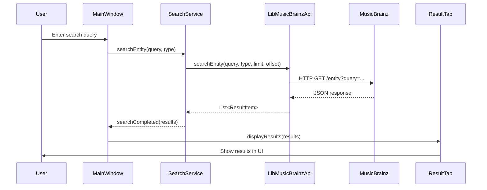
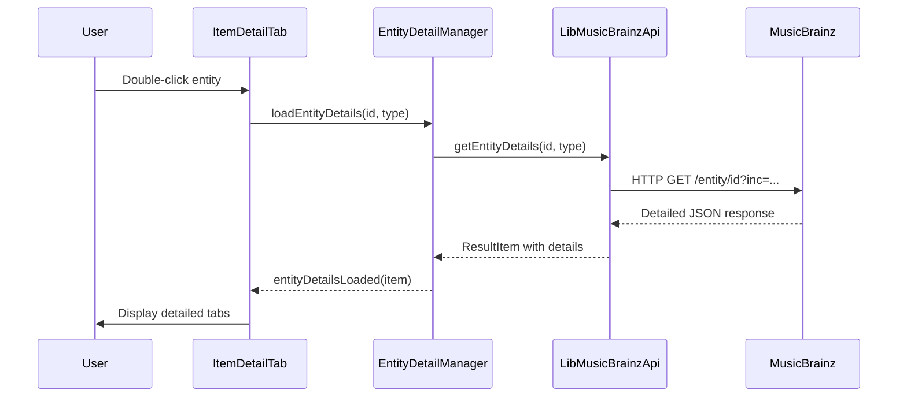

# MusicBrainzQt Architecture Overview

This document provides a comprehensive overview of MusicBrainzQt's software architecture, design patterns, and technical decisions.

## 🏛️ Architectural Overview

MusicBrainzQt follows a **layered architecture** pattern with clear separation of concerns, ensuring maintainability, testability, and extensibility.

```
┌─────────────────────────────────────────────────────────┐
│                    Presentation Layer                   │
│  ┌─────────────┐ ┌─────────────┐ ┌─────────────────────┐ │
│  │ MainWindow  │ │ItemDetailTab│ │EntityListWidget    │ │
│  └─────────────┘ └─────────────┘ └─────────────────────┘ │
│  ┌─────────────┐ ┌─────────────┐ ┌─────────────────────┐ │
│  │SearchResult │ │AdvancedSrch │ │     Other UI        │ │
│  │    Tab      │ │   Widget    │ │   Components        │ │
│  └─────────────┘ └─────────────┘ └─────────────────────┘ │
└─────────────────┬───────────────────────────────────────┘
                  │ Qt Signals & Slots
┌─────────────────▼───────────────────────────────────────┐
│                   Service Layer                         │
│  ┌─────────────────┐     ┌─────────────────────────────┐ │
│  │  SearchService  │     │  EntityDetailManager       │ │
│  │                 │     │                             │ │
│  │ • Coordinates   │     │ • Manages entity details   │ │
│  │   search ops    │     │ • Handles caching          │ │
│  │ • Manages state │     │ • Batch operations         │ │
│  └─────────────────┘     └─────────────────────────────┘ │
└─────────────────┬───────────────────────────────────────┘
                  │
┌─────────────────▼───────────────────────────────────────┐
│                    API Layer                            │
│  ┌─────────────────────────────────────────────────────┐ │
│  │             LibMusicBrainzApi                       │ │
│  │                                                     │ │
│  │ • HTTP request handling                            │ │
│  │ • JSON parsing                                     │ │
│  │ • Rate limiting                                    │ │
│  │ • Error handling                                   │ │
│  │ • User agent management                           │ │
│  └─────────────────────────────────────────────────────┘ │
└─────────────────┬───────────────────────────────────────┘
                  │
┌─────────────────▼───────────────────────────────────────┐
│                  Data Layer                             │
│  ┌─────────────┐ ┌─────────────┐ ┌─────────────────────┐ │
│  │ ResultItem  │ │ResultTable  │ │   ResultItem        │ │
│  │             │ │   Model     │ │     Model           │ │
│  │ • Unified   │ │             │ │                     │ │
│  │   entity    │ │ • Table     │ │ • List view         │ │
│  │   container │ │   display   │ │   support           │ │
│  └─────────────┘ └─────────────┘ └─────────────────────┘ │
└─────────────────────────────────────────────────────────┘
```

## 🧩 Design Patterns

### 1. Model-View-Controller (MVC)

MusicBrainzQt implements a modified MVC pattern adapted for Qt:

- **Models**: `ResultItem`, `ResultTableModel`, `ResultItemModel`
- **Views**: All UI components (`EntityListWidget`, `ItemDetailTab`, etc.)
- **Controllers**: Service layer (`SearchService`, `EntityDetailManager`)

### 2. Observer Pattern

Extensively used through Qt's signal-slot mechanism:

```cpp
// Example: Search coordination
connect(searchService, &SearchService::searchCompleted,
        resultTab, &SearchResultTab::displayResults);

connect(searchService, &SearchService::searchError,
        mainWindow, &MainWindow::showErrorMessage);
```

### 3. Strategy Pattern

Used for handling different entity types:

```cpp
class ItemDetailTab {
    void setupSubTabs() {
        switch (m_item->getType()) {
            case EntityType::Artist:
                createArtistTabs();
                break;
            case EntityType::ReleaseGroup:
                createReleaseGroupTabs();
                break;
            // ... other strategies
        }
    }
};
```

### 4. Factory Pattern

Implicit in Qt's object creation and Qt Designer integration:

```cpp
// UI objects created via Qt's factory mechanism
Ui::MainWindow *ui = new Ui::MainWindow;
ui->setupUi(this);
```

### 5. Singleton Pattern

Used sparingly for global services:

```cpp
class ConfigManager {
    static ConfigManager& instance() {
        static ConfigManager instance;
        return instance;
    }
};
```

## 🏗️ Component Architecture

### Core Components

#### 1. MainWindow
**Responsibility**: Application entry point and primary UI coordination

```cpp
class MainWindow : public QMainWindow {
    // Orchestrates:
    // - Search operations
    // - Tab management  
    // - Menu actions
    // - Status updates
};
```

**Key Relationships**:
- Contains `SearchResultTab` instances
- Manages `ItemDetailTab` creation
- Coordinates with `SearchService`

#### 2. SearchService
**Responsibility**: Search operation coordination

```cpp
class SearchService : public QObject {
    // Manages:
    // - Search request lifecycle
    // - Result pagination
    // - Error handling
    // - Search history
};
```

**Design Decisions**:
- Decouples UI from API layer
- Provides async operation support
- Implements search result caching
- Handles multiple concurrent searches

#### 3. EntityDetailManager
**Responsibility**: Entity detail data management

```cpp
class EntityDetailManager : public QObject {
    // Handles:
    // - Detail data loading
    // - Batch operations
    // - Caching strategy
    // - Data consistency
};
```

**Caching Strategy**:
```cpp
QMap<QString, QVariantMap> m_detailsCache;

// LRU-style cache management
if (m_detailsCache.size() > MAX_CACHE_SIZE) {
    // Remove oldest entries
    removeOldestCacheEntries();
}
```

#### 4. ResultItem
**Responsibility**: Unified entity data container

```cpp
class ResultItem {
    // Universal container for:
    // - All MusicBrainz entity types
    // - Search result data
    // - Detailed entity information
    // - UI display properties
};
```

**Benefits**:
- Type-safe entity handling
- Consistent data access patterns
- Simplified UI data binding
- Extensible for new entity types

#### 5. EntityListWidget
**Responsibility**: Reusable entity list display

```cpp
class EntityListWidget : public QWidget {
    // Provides:
    // - Consistent list display
    // - Context menu operations
    // - Column management
    // - Pagination support
};
```

**Reusability Features**:
- Configurable for any entity type
- Pluggable context actions
- Customizable column visibility
- Integrated pagination controls

## 🔄 Data Flow

### Search Operation Flow



### Detail Loading Flow



## 🎯 Design Decisions

### 1. Qt Framework Choice

**Decision**: Use Qt 6 with Widgets module
**Rationale**:
- Cross-platform native look and feel
- Mature ecosystem and tooling
- Excellent model-view architecture
- Built-in networking and JSON support
- Designer integration for UI development

### 2. Unified Entity Model

**Decision**: Single `ResultItem` class for all entities
**Rationale**:
- Simplifies UI components (one list widget handles all types)
- Reduces code duplication
- Easier to extend for new entity types
- Consistent data access patterns

**Trade-offs**:
- Less type safety than separate classes
- Requires runtime type checking
- Potentially larger memory footprint

### 3. Service Layer Architecture

**Decision**: Separate service classes for business logic
**Rationale**:
- Decouples UI from API implementation
- Enables better testing
- Provides clear responsibility boundaries
- Facilitates code reuse

### 4. Async API Operations

**Decision**: All API calls are asynchronous
**Rationale**:
- Prevents UI freezing
- Better user experience
- Handles network latency gracefully
- Supports concurrent operations

### 5. .ui File Usage

**Decision**: All layouts defined in Qt Designer files
**Rationale**:
- Visual layout design
- Separation of concerns
- Easier maintenance by designers
- Automatic code generation

## 🔧 Extension Points

### Adding New Entity Types

1. **Update EntityType enum**:
```cpp
enum class EntityType {
    // ... existing types
    NewEntityType
};
```

2. **Extend ResultItem handling**:
```cpp
QString ResultItem::getTypeString() const {
    switch (m_type) {
        // ... existing cases
        case EntityType::NewEntityType:
            return tr("New Entity");
    }
}
```

3. **Add API support**:
```cpp
void LibMusicBrainzApi::searchEntity(EntityType type, ...) {
    QString endpoint;
    switch (type) {
        // ... existing cases
        case EntityType::NewEntityType:
            endpoint = "new-entity";
            break;
    }
}
```

4. **Create UI tabs**:
```cpp
void ItemDetailTab::setupSubTabs() {
    switch (itemType) {
        // ... existing cases
        case EntityType::NewEntityType:
            createNewEntityTabs();
            break;
    }
}
```

### Adding New Search Features

1. **Extend SearchService**:
```cpp
class SearchService {
public slots:
    void advancedSearch(const AdvancedSearchQuery &query);
};
```

2. **Update UI components**:
```cpp
class AdvancedSearchWidget {
    void setupNewSearchFields();
};
```

### Adding New API Features

1. **Extend API interface**:
```cpp
class LibMusicBrainzApi {
public slots:
    void getEntityStatistics(const QString &entityId);
};
```

2. **Update data models**:
```cpp
class ResultItem {
    void setStatistics(const QVariantMap &stats);
};
```

## 🧪 Testing Architecture

### Unit Testing Strategy

```cpp
// Service layer tests
class TestSearchService : public QObject {
    void testBasicSearch();
    void testPaginatedSearch();
    void testErrorHandling();
};

// Model tests  
class TestResultItem : public QObject {
    void testDataIntegrity();
    void testTypeConversion();
};

// API tests
class TestLibMusicBrainzApi : public QObject {
    void testRequestFormatting();
    void testResponseParsing();
    void testRateLimiting();
};
```

### Integration Testing

```cpp
// End-to-end workflow tests
class TestSearchWorkflow : public QObject {
    void testCompleteSearchFlow();
    void testDetailLoadingFlow();
    void testErrorRecovery();
};
```

## 📊 Performance Considerations

### Memory Management

1. **Smart Pointers**: Use `QSharedPointer` for shared objects
2. **Object Ownership**: Leverage Qt's parent-child system
3. **Data Caching**: Implement LRU cache for entity details
4. **Lazy Loading**: Load detailed data only when needed

### Network Optimization

1. **Rate Limiting**: Strict 1-second delays between requests
2. **Request Batching**: Group related operations when possible
3. **Connection Pooling**: Reuse network connections
4. **Compression**: Support gzip compression for responses

### UI Performance

1. **Model-View**: Use Qt's efficient model-view classes
2. **Virtual Scrolling**: Handle large result sets efficiently
3. **Progressive Loading**: Load UI elements as needed
4. **Background Processing**: Move heavy operations to worker threads

## 🔐 Security Architecture

### API Security

1. **Rate Limiting**: Prevent API abuse
2. **User Agent**: Proper identification
3. **Input Validation**: Sanitize all user inputs
4. **Error Handling**: Don't expose internal details

### Data Security

1. **No Sensitive Data**: No authentication tokens or personal data
2. **Secure Networking**: Use HTTPS for all API communications
3. **Input Sanitization**: Clean all data from external sources

## 🚀 Deployment Architecture

### Build System

1. **CMake**: Primary build system
2. **qmake**: Alternative build system
3. **Qt Creator**: Integrated development environment
4. **CI/CD**: Automated builds and testing

### Platform Support

1. **Windows**: Native Windows application
2. **macOS**: Native macOS application bundle
3. **Linux**: AppImage and distribution packages

## 📈 Future Architecture Considerations

### Planned Enhancements

1. **Plugin System**: Extensible plugin architecture
2. **Local Database**: SQLite caching layer
3. **Real-time Updates**: WebSocket support
4. **Modular UI**: Plugin-based UI components

### Scalability Improvements

1. **Worker Threads**: Background processing
2. **Database Layer**: Local persistence
3. **Microservices**: Separate API services
4. **Configuration Management**: External configuration

---

This architecture documentation evolves with the codebase. Please update it when making significant architectural changes.
